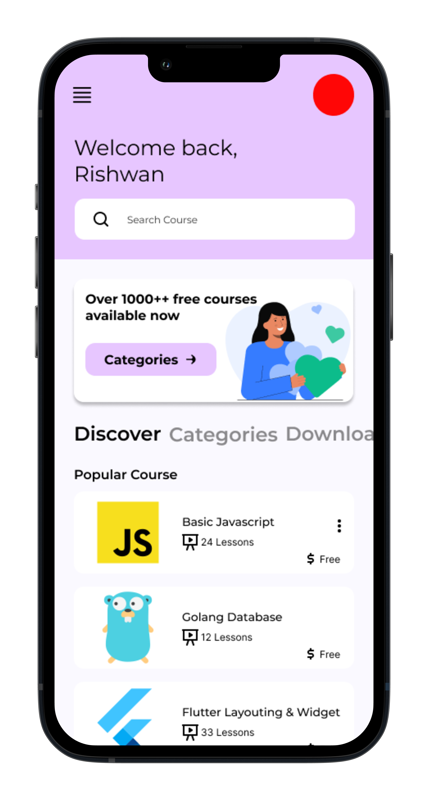

 

# Learnywhere
Learn anywhere and getting better than yesterday.

### Links
- [UI/UX](ui/README.md)
- [Flowchart](flowchart//README.md)
- [APK](release_apk/README.md)

### What is Learnywhere ?
Learnywhere is application that you can find out course and learn without worry where or when you can learn.
In future, you can also upload your course for free. so, we waiting for you guys 😙.

### Note
This app still under development. we also open to contribution.

### Installation
COMMING SOON

### Features
COMMING SOON